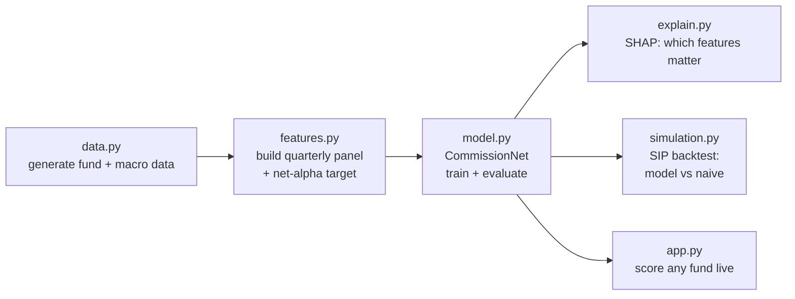

# CommissionLens — Project Walkthrough

A plain-language guide to what this project does, how the pipeline fits together, and what
every file is responsible for. Read this top to bottom and you will be able to explain the whole
system to anyone. A ready-to-post LinkedIn draft is at the end.

---

## 1. The one-line idea

In India, the same mutual fund is sold in two versions: a **direct plan** and a **regular plan**.
They hold the identical portfolio under the identical manager. The only difference is that the
regular plan quietly charges an extra **0.5 to 1.5 percent per year** as distributor commission.
Most retail investors buy the regular plan without realising this, and over a long SIP that gap
compounds into a large amount of lost money.

**CommissionLens asks one question for every fund, every quarter:**
> Will this fund's active management generate enough alpha next quarter to be worth the extra
> commission you pay for its regular plan?

If yes, the commission is "justified". If no, the investor is paying for underperformance.

---

## 2. The core concept: net alpha

- **Alpha** = how much a fund beats its benchmark (Nifty 50) after adjusting for market risk
  (beta). Positive alpha means the manager added value.
- **Expense gap** = the extra annual commission of the regular plan over the direct plan.
- **Net alpha** = alpha minus the expense gap. This is the number that actually matters to a
  regular-plan investor.

```
net alpha = (fund alpha over benchmark)  -  (regular-vs-direct commission)
```

We predict **next quarter's net alpha** two ways at once:
1. **Regression** — the exact net alpha value.
2. **Classification** — is it positive? (label: "commission justified" = 1 / 0)

---

## 3. The pipeline at a glance



Four commands run the whole thing:

| Command | What it does | Outputs |
|---|---|---|
| `py main.py build` | Generate data and engineer the feature panel | `data/panel.parquet` |
| `py main.py train` | Train CommissionNet, score it on held-out quarters | `artifacts/commissionnet.pt`, `metrics.json` |
| `py main.py explain` | Rank the features that drive the prediction (SHAP) | `artifacts/shap_importance.csv` + `.png` |
| `py main.py simulate` | Back-test a real SIP: model-guided vs naive | `artifacts/simulation.json` + `sip_xirr.png` |

`py main.py all` runs them in order.

---

## 4. What each file does

### `config.py` + `config.yaml`
All the knobs in one place: number of funds, date range, rolling-window length, sequence length,
learning rate, SIP amount, and so on. `config.yaml` holds the values; `config.py` loads them into
typed Python objects. Change behaviour here without touching any logic.

### `data.py` — where the data comes from
- `generate_synthetic_panel(...)` simulates **220 Indian equity funds over 2013-2023**. Each fund
  gets a hidden "skill" level, a market beta, and random noise. It produces daily NAV paths for
  both the direct and regular plans (the regular plan trails by the commission gap), a macro block
  (repo rate, inflation, yield-curve slope, FII/DII flows), and per-fund attributes (AUM, manager
  tenure, turnover, expense ratios).
- `mfapi_nav_history` / `mfapi_fetch_many` pull **real** NAV data from the public mfapi.in API.
- `load_macro_csv` reads a real RBI/NSDL macro export.

The synthetic generator lets the entire project run offline and reproducibly; flip
`data.source: mfapi` in the config to use live data instead.

### `features.py` — turning raw prices into signals
Two jobs:
1. **Risk metrics** computed over a trailing 36-month window at each quarter end:
   `annualized_alpha`, `beta`, `sharpe_ratio`, `information_ratio`, `tracking_error`,
   volatility, and `max_drawdown`.
2. `build_panel(...)` assembles everything into one clean table where each row is one
   fund-quarter, with 18 feature columns plus the forward-looking net-alpha target and the
   commission-justified label. This is the dataset the model learns from.

### `model.py` — the brain (CommissionNet)
This is deliberately **not** the usual XGBoost/LightGBM. Because each fund is a *sequence* of
quarters, the model is a small neural network:
- `build_sequences` turns the panel into windows of 8 consecutive quarters per fund.
- `temporal_split` splits by time (train on the past, test on the most recent quarters) so the
  model is never tested on information it could not have known.
- `CommissionNet` = a **bidirectional GRU** (reads the 8-quarter history) + an **attention layer**
  (decides which quarters matter most) + **two output heads** (one for the net-alpha number, one
  for the justified/not label).
- `train_model` handles the training loop with early stopping.
- `evaluate_model` reports RMSE, R2, AUC-ROC, F1, and precision at the top decile.

### `explain.py` — why the model decides what it decides
`compute_feature_importance` uses **SHAP** to rank which of the 18 features push the model toward
"commission justified". This turns the network from a black box into an explainable tool.

### `simulation.py` — does it actually make money?
- `xirr` computes the annualised return of a stream of dated cashflows (the standard way to
  measure SIP returns).
- `run_sip` simulates a real Rs 5,000/month SIP over 2018-2023 and compares two strategies:
  a **naive** investor who buys every fund, versus a **model-guided** investor who each quarter
  concentrates on the funds the model scores highest. Same money in, different funds, compare the
  final corpus and XIRR.

### `main.py` — the single control panel
Wires everything together into the four subcommands above. This is the only file you run.

### `app.py` — the interactive demo
A Streamlit dashboard: pick any fund, instantly see its commission-justification score, predicted
next-quarter net alpha, and its history. Run with `py -m streamlit run app.py`.

### `notebook.ipynb`
The same pipeline as a step-by-step notebook with charts, for reading and presentation.

### `test_commissionlens.py`
Unit tests for the maths (metrics, XIRR, data generation, panel building, SIP). They run without
the heavy deep-learning libraries.

---

## 5. Why a GRU and not XGBoost

Tree ensembles treat every row as independent and unordered. But fund data has a **time axis**:
this quarter follows last quarter, and recency and trend matter. A GRU (Gated Recurrent Unit) is
built to read ordered sequences, and the attention layer makes it possible to see *which* past
quarters drove each prediction. That temporal reasoning is the whole point, and it is what sets
this apart from the default modelling reflex.

---

## 6. Results (default run, seed 7)

- **Prediction quality:** AUC-ROC **0.728**, and **precision at the top decile 0.818** versus a
  base rate of 0.449. In plain terms: of the funds the model is most confident about, **82
  percent actually justify their commission** next quarter, almost double random.
- **Most predictive features:** information ratio, Sharpe ratio, rolling alpha, tracking error
  (skill-consistency signals) plus FII flows.
- **SIP backtest 2018-2023:** the model-guided SIP earned **22.68 percent XIRR** versus **19.51
  percent** for naive regular investing, a **3.17 percentage-point edge** and roughly Rs 39,000
  more corpus on the same Rs 300,000 invested.

*Note: the default dataset is synthetic, so these numbers prove the pipeline works end to end;
they are not a claim about any specific real fund.*

---

## 7. How to run it

```
py -m venv .venv
.venv\Scripts\activate
py -m pip install -r requirements.txt

py main.py all                 # build -> train -> explain -> simulate
py -m streamlit run app.py     # optional dashboard
py -m pytest                   # tests
```

---

## 8. LinkedIn post draft

> Most Indian investors don't realise they're paying a hidden tax on their mutual funds.
>
> The "regular" plan of a fund charges 0.5-1.5% more every year than the identical "direct" plan
> just distributor commission for the same portfolio and manager. Over a long SIP, that gap
> quietly eats a big chunk of returns.
>
> So I built CommissionLens: a system that predicts, for every fund each quarter, whether its
> active management will actually generate enough alpha to be worth that extra commission.
>
> A few things I'm proud of:
>
> - Instead of the usual gradient-boosted trees, I used a bidirectional GRU with an attention
>   layer, because a fund is a sequence of quarters and the order matters. The model reads a
>   fund's recent history and predicts next-quarter "net alpha" (alpha minus commission) as both
>   a number and a yes/no call.
> - SHAP explainability showed the strongest signals are skill-consistency metrics: information
>   ratio, Sharpe, rolling alpha not fund size or fees alone.
> - I back-tested it as a real SIP over 2018-2023. Concentrating each quarter into the funds the
>   model rated highest beat naive regular-plan investing by ~3.2 percentage points of XIRR on
>   identical contributions.
>
> Full pipeline data engineering, a PyTorch model, SHAP explainability, and an XIRR-based SIP
> simulation with a Streamlit dashboard on top.
>
> Tech: Python, PyTorch, scikit-learn, SHAP, SciPy, Streamlit.
>
> #MachineLearning #Fintech #DeepLearning #Python #MutualFunds #DataScience

Tweak the tone to sound like you, add the GitHub link, and you are set.
